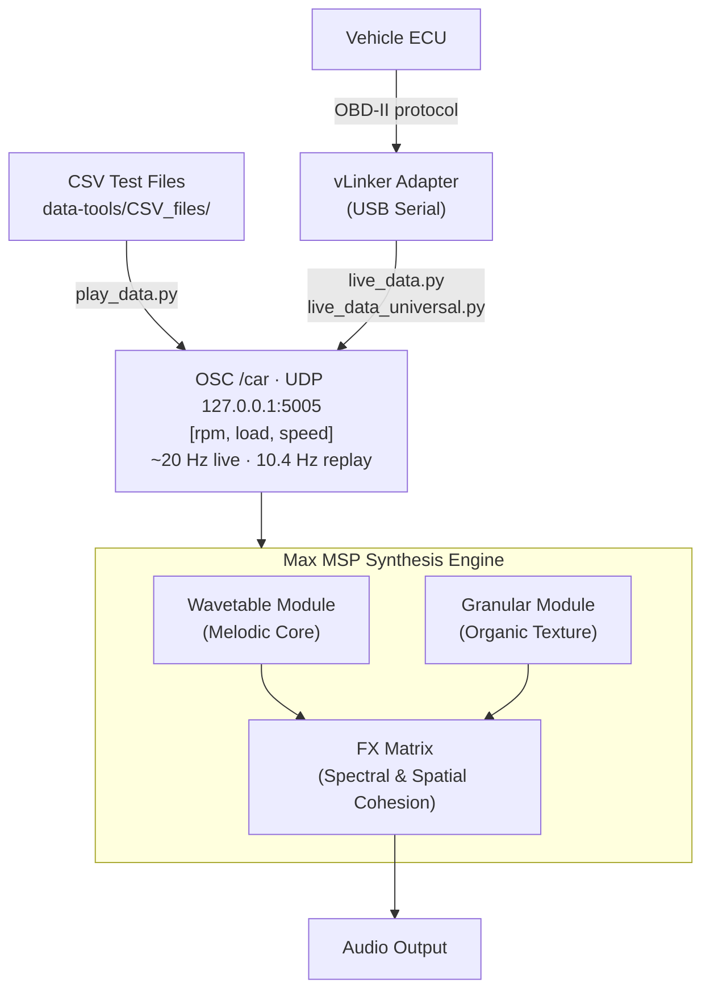
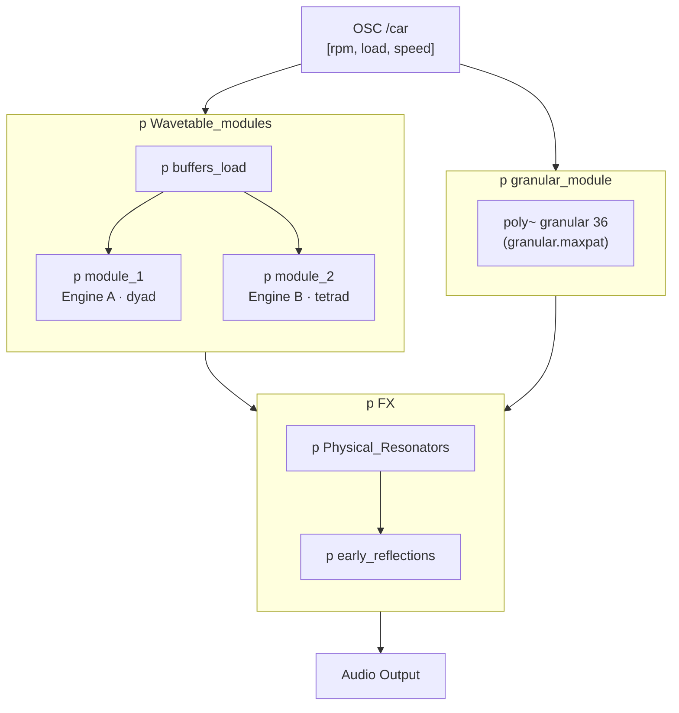

# EV Engine Sound Sonification

A real-time synthesis engine that turns live vehicle telemetry into an interior engine sound for electric vehicles. Telemetry is read from the OBD-II port, streamed over OSC, and used to drive a hybrid wavetable/granular engine in Max MSP. Validated on the road, in a moving vehicle.

**Matteo Caruso Linardon** — concept, telemetry pipeline, synthesis design and Max MSP implementation. Road testing conducted with **Luca Piscanec**, who provided the test vehicle and drove every recorded session.

[](https://youtu.be/57LZ0kxlU8A)

*▶ Road test: the live OBD-II to OSC stream driving the Max MSP engine across idle, acceleration, cruise and deceleration.*

The hard part was never the synthesis. **The ECU answers on its own schedule, not the audio engine's**: measured across 18 recorded drives, a new telemetry frame arrives every 96 ms, while the DSP needs a value every 1.33 ms. Roughly 72 audio blocks elapse between one frame and the next, and occasionally 191. The engineering problem was reconstructing a continuous, believable control signal from that — and deciding what the sound should do when a frame is simply late.

## What this project demonstrates

- **Measurement over assumption.** The project assumed a 20 Hz telemetry rate. Measuring 22,367 recorded frames showed [10.4 Hz, at a 96 ms median interval](#the-constraint-telemetry-arrives-72-audio-blocks-apart) — and several design claims changed as a result.
- **A defect characterised, not guessed at.** Intermittent pitch dropouts were traced to [an exact 128-frame grid](#what-happens-when-a-frame-is-lost), which identified them as an acquisition-stack artefact rather than a driving event.
- **Decisions with a price attached.** The three-parameter ceiling is [quantified](#why-only-three-parameters): a fourth OBD-II request costs 16% of the live frame rate — which is why reverse gear never got its own sound.
- **A benchmark that contradicted its author.** CPU profiling showed the [36-voice granular limit was never a CPU compromise](#what-it-costs), as had been assumed. It was purely timbral, and this document says so.
- **Reproducible from this repository.** Every telemetry figure is regenerated by [`analyze_telemetry.py`](#reproducing-these-measurements) using the standard library alone — no vehicle and no dependencies required.
- **Assessed on the road by domain experts.** A conservatory examination panel evaluated the system [from inside the moving car](#evaluated-in-context), not from a recording — and this document is explicit about why that still is not a user study.

> **Scope.** This is an *interior*, driver-facing sound. It is **not** a homologated AVAS: UN R138 and FMVSS 141 regulate *exterior* warning sound for pedestrian safety, and no claim of compliance with either is made here. The prototype was developed on a combustion test vehicle, whose telemetry stands in for an EV's — see [Known Limits & Scope](#known-limits--scope).

## Design Intent

A combustion engine tells the driver things no instrument does. Its pitch and its roughness are a continuous, ambient report on speed and effort, and drivers act on that report without ever consciously consulting it: shifting gear, easing off, moderating consumption when the engine audibly strains. An electric vehicle removes the channel entirely.

The goal here is to give it back — **not as a measurement to be read, but as a correlation to be absorbed.** The sound should let a driver estimate how fast they are moving and how hard the car is working, peripherally, in the same way engine noise already does, and in doing so keep them connected to the machine rather than insulated from it. Single-speed EVs offer no gear change for that feedback to prompt; multi-speed electric drivetrains, currently being explored, would give it a concrete task again.

Every synthesis decision follows from this. Speed and effort have to be legible as *separate* sensations, which is why they are mapped to independent perceptual axes rather than sharing one. And the result has to be heard as a single source — the voice of the car — rather than as the layers of a synthesiser, which is what the entire FX chain exists to enforce.

> **This is a design position, not a validated finding.** No user study was run, and no claim is made that the system measurably improves driving behaviour. What has been tested is that it works on the road; the rationale above is the intent it was built to serve.

---

## Table of Contents

- [Design Intent](#design-intent)
- [System Data Flow](#system-data-flow)
- [Engineering for Real Time](#engineering-for-real-time)
  - [The constraint: telemetry arrives 72 audio blocks apart](#the-constraint-telemetry-arrives-72-audio-blocks-apart)
  - [Why only three parameters](#why-only-three-parameters)
  - [Two signals, opposite failure modes](#two-signals-opposite-failure-modes)
  - [What happens when a frame is lost](#what-happens-when-a-frame-is-lost)
  - [What it costs](#what-it-costs)
  - [Reproducing these measurements](#reproducing-these-measurements)
- [MAX/MSP Patch](#maxmsp-patch)
  - [What was tried first](#what-was-tried-first)
  - [Wavetable Module (Melodic Core)](#wavetable-module-melodic-core)
  - [Granular Module (Organic Micro-Synthesis)](#granular-module-organic-micro-synthesis)
  - [FX Matrix (Spectral & Spatial Cohesion)](#fx-matrix-spectral--spatial-cohesion)
- [Validation](#validation)
  - [The 18 recorded scenarios](#the-18-recorded-scenarios)
  - [What the recordings revealed](#what-the-recordings-revealed)
  - [What only the road revealed](#what-only-the-road-revealed)
  - [Evaluated in context](#evaluated-in-context)
  - [Coverage, and where it is thin](#coverage-and-where-it-is-thin)
- [Known Limits & Scope](#known-limits--scope)
- [What Comes Next](#what-comes-next)
- [Prerequisites](#prerequisites)
- [Installation](#installation)
- [Project Structure](#project-structure)
- [Usage](#usage)
  - [Live Operation with Vehicle](#live-operation-with-vehicle)
  - [Testing with Recorded Data (No Vehicle Required)](#testing-with-recorded-data-no-vehicle-required)
  - [Recording New Vehicle Data](#recording-new-vehicle-data)
  - [Analysing Recorded Telemetry](#analysing-recorded-telemetry)
- [Data Format](#data-format)
- [Test Datasets](#test-datasets)
- [Dependencies](#dependencies)
- [Troubleshooting](#troubleshooting)
- [Development Workflow](#development-workflow)
- [Notes](#notes)

---

## System Data Flow



---

## Engineering for Real Time

### The constraint: telemetry arrives 72 audio blocks apart

OBD-II is a request/response protocol: the bridge asks for one parameter and waits for the ECU to answer. Nothing is pushed. Measured over **22,367 frames across 18 drives (35.8 minutes of telemetry)**:

| | measured |
| --- | --- |
| Median frame interval | **96 ms → 10.4 Hz effective** |
| Standard deviation | 2.5 ms |
| 99th percentile | 98 ms |
| Worst case | 254 ms (2.65× the median) |
| Frames later than 100 ms | 162 (0.72%) |
| Frames later than 150 ms | 9 (0.04%) |
| Audio blocks between frames (64 smp @ 48 kHz) | median 72, worst **191** |

Two things follow. First, the link is far more *stable* than expected — a 2.5 ms deviation on a 96 ms period is tight for a polled serial protocol — but the rare outliers are 2.65× the median, so any interpolation scheme has to survive a frame arriving nearly three times late. Second, and more importantly, **the audio engine is roughly seventy times faster than its own input.** Latency in this system is not a DSP problem; it is entirely dominated by the acquisition path. Optimising the synthesis for a few hundred microseconds would be optimising the wrong end.

The 96 ms figure is also structural, not a property of the vehicle. `rec_data.py` issues three blocking queries and then sleeps a fixed 50 ms, so the excess over that sleep is the protocol cost: **15.3 ms per PID round-trip.**

### Why only three parameters

The engine is driven by three values — RPM, engine load, speed — and that is a deliberate ceiling, not a limitation of the ECU. Because queries are sequential and blocking, every additional parameter costs a full round-trip and is paid on *every* frame:

| PIDs requested | Live bridge | Recorder |
| --- | --- | --- |
| 3 (current) | 20.0 Hz | 10.4 Hz |
| 4 | 16.3 Hz | 9.0 Hz |
| 5 | 13.0 Hz | 7.9 Hz |
| 6 | 10.9 Hz | 7.0 Hz |

A fourth parameter costs 16% of the live frame rate. What that buys in mapping richness, it takes back in resolution on the three signals that actually carry the sound — the control signal gets coarser and its steps get bigger and more audible. Three was the point where the trade stopped paying.

The live bridge holds 20 Hz only because it subtracts query time from its 50 ms target (`wait_time = max(0, 0.05 - elapsed)`). With three PIDs costing ~46 ms, that leaves **about 4 ms of headroom**: a fourth parameter does not degrade the rate gracefully, it blows the deadline outright.

### Two signals, opposite failure modes

The three inputs do not misbehave in the same way, so they cannot be smoothed in the same way.

| Signal | Distinct values | Frames that change | p99 jump | Max jump |
| --- | --- | --- | --- | --- |
| RPM | 2078 | 94.8% | 183 | 1959 |
| Engine load | 234 | 41.8% | 30.6 | 89.4 |
| Speed | 121 | **18.0%** | 1.0 | 54.0 |

**Speed is a staircase.** It arrives quantised to integer km/h and changes on fewer than one frame in five. At steady cruise it holds a single value for a mean of 5–8 frames and, in the worst case measured, **48 consecutive frames — 4.6 seconds frozen**:

| Run | Distinct values | Longest hold |
| --- | --- | --- |
| `03_CAL_Cruising_30kmh` | 4 | 48 frames (4.6 s) |
| `04_CAL_Cruising_50kmh` | 13 | 45 frames (4.3 s) |
| `05_CAL_Cruising_90kmh` | 13 | 22 frames (2.1 s) |
| `14_Highway_max_speed` | 49 | 30 frames (2.9 s) |

This is what actually justifies interpolating the control signals, and the reason is stronger than avoiding zipper noise. Speed drives the granular buffer read position at 1 s ≡ 10 km/h, so a single 1 km/h increment is an instantaneous 0.1 s jump in the buffer — a discontinuity in *timbre*, not just in amplitude. Applied raw, a steady cruise would produce a sound that sits perfectly still for seconds and then lurches. Every continuous input is therefore ramped to the next value over the expected frame interval (`line~`), which turns the staircase back into motion.

**RPM is the opposite problem**: it changes on 94.8% of frames and is never still, but its 99th-percentile jump is 183 RPM and its worst is 1959 RPM in a single frame. Here smoothing is not about filling silence but about absorbing spikes without dulling the response that makes acceleration feel immediate — the transient the driver is listening for.

### What happens when a frame is lost

When the ECU returns nothing, `extract_value()` substitutes `0.0`. Reaching the synthesiser, that is not a missing value but an assertion that the engine has stopped: pitch collapses for one frame and recovers. It is the worst possible artefact, and it is audible in the road test video.

The recordings characterise it precisely. Isolating frames that report zero RPM while the vehicle is moving — physically impossible, so unambiguously lost responses — gives 43 events across all runs, with a very specific signature:

- every event is exactly **one frame** long, never two consecutive;
- RPM returns to within ~3% of its previous value on the next frame;
- RPM and engine load are **never** zero in the same frame (0 of 43): each event hits a single PID;
- events appear only after roughly 4.5 minutes of continuous session, which is why only the two longest runs contain any;
- **every interval between events is an exact multiple of 128 frames** (128, 256, 384, 512 — no exceptions).

A strict 128-frame grid is not driving behaviour. This is a periodic artefact of the acquisition stack — an adapter keep-alive or an internal retry in the OBD layer — not a vehicle event, and the fix is a hold-last-valid-value guard rather than anything in the synthesis. It is documented here rather than patched because of the deliberate scope decision described in [Known Limits & Scope](#known-limits--scope).

### What it costs

Measured on a MacBook Pro (M4 Pro, 24 GB, mains power), macOS 26.5.2, Max at 48 kHz, Overdrive off, Scheduler in Audio Interrupt off, CoreAudio built-in output. Figures are Max's own DSP reading — the fraction of the audio callback deadline consumed, not system-wide CPU. Stimulus is `14_Highway_max_speed`, the heaviest run in the corpus (76.2% mean engine load, 65% of frames above 80%, highest mean RPM), replayed through `play_data.py`. Three repetitions per configuration, sampled at 4 Hz via `adstatus cpu`.

| `poly~` voices | Vector | Mean CPU | Peak CPU |
| --- | --- | --- | --- |
| — (DSP on, no telemetry) | 64 | 1.00% | 1% |
| 12 | 64 | 1.00% | 1% |
| 24 | 64 | 1.09% | 2% |
| **36 (shipping)** | **64** | **2.00%** | **2%** |
| 48 | 64 | 2.00% | 2% |
| 64 | 64 | 3.00% | 3% |
| 36 | 256 | 2.90% | 3% |

**CPU was never the binding constraint on voice count**, and this measurement corrects an assumption the project was built on. Cost grows linearly with allocated voices at roughly 0.04 points per voice — about one percentage point per 25 voices — with no knee anywhere in the range tested. A linear model through the endpoints predicts 1.46% at 24 voices and 2.38% at 48; both round to exactly what the meter reported, at every point. Running 64 voices instead of 36 would have cost one additional percentage point. **The 36-voice limit was therefore a timbral decision, not an economic one**: past that point the texture stopped changing audibly, and the CPU saving was incidental rather than the reason.

**The larger buffer is strictly worse.** Raising the vector from 64 to 256 samples increased CPU from 2.00% to 2.90% *while quadrupling output latency* (1.33 ms to 5.33 ms at 48 kHz). The likely mechanism is architectural: a `poly~` voice is computed for a whole vector once it is active, so the quantum of the just-in-time activation *is* the vector size, and short grains waste proportionally more of a long block. This patch is cheaper at low latency, inverting the usual trade-off — there is no configuration in which 256 is worth choosing. This is one comparison, not a controlled isolation of the mechanism.

Over a 13-minute run (`17_ENV_Suburban`, 36 voices, vector 64) the mean was 2.13% and the peak 3%: no drift and no accumulation across a realistic session.

**The limiting factor is the instrument, not the patch.** Max reports DSP load quantised to roughly 1%, and the whole experiment spans three steps of it. A configuration reading a flat "2.00%" means every sample read exactly 2, not that the true value is 2.000. Repeatability was excellent — 0.13 points of spread across the 24-voice triplet, 0.04 across the 256-vector triplet — so the trend is trustworthy, but nothing finer than "linear, ~0.04 points per voice" is supportable from this data.

### Reproducing these measurements

Every telemetry figure above is produced by `data-tools/analyze_telemetry.py` from the CSV files in this repository, using the standard library only. No vehicle and no virtual environment required:

```bash
cd data-tools
python analyze_telemetry.py
```

The CPU figures are reproducible from the configuration stated above but are not scripted, and end-to-end latency was never instrumented — the acquisition path dominates it by roughly two orders of magnitude, so it was not the useful thing to measure. The timing and CPU claims are measurements; the perceptual claims below are the judgement of the developer and the driver, and are labelled as such.

---

## MAX/MSP Patch

The engine runs two synthesis methods in parallel because neither could carry the sound alone. The wavetable core provides pitched, harmonic identity under precise control; the granular layer provides the roughness and unpredictability that keeps it from sounding synthetic. Fusing them into one perceived source is the job of the FX matrix.

`engineV1.maxpat` holds 469 objects, but the top level holds only three: the whole engine is delegated to three module subpatchers, each self-contained and separately testable against replayed telemetry.



The voice count is not a claim about the patch, it is the patch: `poly~ granular 36` carries it as an object argument, and the granular voice itself lives in `granular.maxpat` as a separate 41-object file.

> **On the perceptual language below.** Words like *hollowness*, *tension* and *urgency* describe what each mapping is **intended** to produce, and what two listeners heard on the road. They are design rationale, not measured psychoacoustics and not user-tested — see [Known Limits & Scope](#known-limits--scope). The measured claims in this document are confined to [timing and CPU](#engineering-for-real-time).

### What was tried first

**FM synthesis was rejected on timbre.** It reached inharmonic, metallic territory too readily, and its results were simultaneously predictable and hard to steer — the opposite of the organic, slightly rustic character the project is after. Spectral richness was never the problem; malleability was.

**Physical modelling was prototyped and abandoned.** It was expensive, but cost was not the deciding objection: robustness was. A physical model's stability depends on its inputs staying inside the range it was tuned for, and this system's input is a polled telemetry stream that delivers 1959 RPM jumps between consecutive frames and occasional hard zeros. A synthesis method that unexpected values can drive into unexpected states is the wrong choice when the input is *known* to misbehave.

Wavetable and granular synthesis both fail gracefully by comparison: a bad value produces a wrong sound, never an unstable one. Choosing a method that degrades predictably was a direct consequence of what the telemetry measurements showed.

### Wavetable Module (Melodic Core)

Wavetable synthesis was chosen for the harmonic layer because it builds chordal material efficiently and exposes exactly two parameters that matter most here, independently controllable: **pitch of the chord**, driven by RPM, and **brightness**, driven by engine load through the scan position in the table. Effort and speed therefore move separate perceptual axes instead of fighting over one.

Two engines run on distinct lookup tables, interpolated in real time:

- **Engine A (dyad):** at low speed, a stable harmonic anchor built on a **major third**. As velocity rises the interval opens to a **perfect fifth** — an emptier sonority intended to withhold resolution as the car accelerates, rather than reward it.
- **Engine B (tetrad):** an independent, spectrally richer table configured as a **major seventh**. Above 100 km/h the chord becomes a **minor seventh**, intended to raise inner-harmonic tension and a sense of urgency.

**Telemetry mapping:**

- **RPM** maps to three destinations at once: the wavetable read position, the fundamental frequency (through an interpolated geometric mapping that keeps a constant ratio with the granular layer, so the two engines stay spectrally aligned), and the balance of upper partials against the fundamental — low RPM favours f0 for a dark, warm timbre, high RPM introduces brilliance.
- **Engine load** modulates the rate of inter-octave beating across the modules, mapping mechanical effort to an accelerating micro-tremolo.
- **Speed** crossfades Engine A into Engine B: low speeds keep the foundational dyad dominant, high speeds shift exposure toward the denser, unresolved tetrad.

### Granular Module (Organic Micro-Synthesis)

The granular layer supplies friction, mechanical breath and roughness. Its purpose is the unpredictable, slightly rustic quality of a combustion engine — reinterpreted rather than reproduced — which is precisely what a purely wavetable EV sound cannot produce: without it the result is clean, linear and recognisably digital.

- **Voice allocation:** 36 parallel instances of a custom granular voice in `poly~`, chosen as the point where adding voices stopped producing an audible change in texture density. This was assumed at the time to also be a CPU compromise; [measurement later showed it was not](#what-it-costs) — 64 voices would have cost one additional percentage point. The limit is purely timbral, and the honest version is that the ear set it and the budget never objected. Voices are computed and unmuted *only* for the duration of a grain's window and muted immediately on termination; the vector-size result suggests this activation is doing real work, since its effectiveness degrades measurably as the block grows.
- **Buffer mapping:** grains are read from a 22-second reference buffer at a scale of **1 s ≡ 10 km/h**, a linear mapping so that timbre tracks speed proportionally rather than through a curve that would have to be retuned per vehicle. 22 seconds therefore covers 220 km/h — headroom chosen for the target class of vehicle, not for the test car, which never exceeded 122 km/h.
  - *Low speed:* grains are restricted to the early buffer, harmonically rich, smooth and warm.
  - *High speed:* the read window shifts to the later buffer, which is inharmonic, dense and physically rough.
- **Parameter windowing:** each voice draws from a stochastic boundary window updated by low-frequency data arrays, so micro-structure never repeats identically.
- **Telemetry mapping:** *RPM* controls grain playback speed and transposition ratio, keeping the texture tuned to the wavetable core. *Engine load* governs trigger density and grain duration — low load gives sparse, wide, overlapping grains and a smooth envelope; high load switches to dense, ultra-short grains and acoustic urgency.

### FX Matrix (Spectral & Spatial Cohesion)

The FX stage exists for a single reason: two independent synthesis methods must be heard as one sound source, not as two. If the listener resolves them into separate voices, the illusion fails — the car stops having *a* voice and starts having a soundtrack. This is also why the wavetable and granular layers are locked to a constant frequency ratio rather than left to drift independently: shared pitch motion is the first condition for perceptual fusion, and the FX chain enforces the rest.

1. **Overdrive and non-linear waveshaping:** controlled odd-harmonic distortion. Generating identical, phase-locked upper partials across both engines is the mechanism relied on to fuse the two sources into one perceived sound.
2. **Resonant filterbank:** a multi-channel filter array standing in for the cavity resonances of a physical chassis. Forcing both engines through identical static formant peaks gives them a shared structural signature.
3. **Early reflections network:** a short tapped delay line matrix that places the result in a small, concrete space, so the sound reads as belonging to the cabin rather than to the playback system.

---

## Validation

### The 18 recorded scenarios

Every drive was recorded to CSV before any tuning was done. The point was not archival: it was a **reproducible iteration loop**. Telemetry replayed through `play_data.py` reaches Max at its original timing, so a change to the patch can be judged against the exact same 4.6-second speed freeze or the exact same load spike that exposed the problem — without booking a car, a driver and a road. The 18 runs total 35.8 minutes of telemetry and cover calibration, dynamics, stress and environment cases.

### What the recordings revealed

**Reverse gear is invisible.** In reverse, speed is reported as a positive number: nothing in the three-parameter stream distinguishes backing up from moving forward. A dedicated reverse sound would have required a fourth PID *plus* additional logic to infer gear state — the first costs 16% of the frame rate (see [Why only three parameters](#why-only-three-parameters)), the second costs latency on every frame. The feature was dropped rather than pay both.

**Gear changes drop the pitch.** On the combustion test vehicle, RPM falls during a shift and the sound follows it downward — visible in the demo video as a dip that has no counterpart in how an EV behaves.

**Lost frames are periodic, not random.** The zero-value artefact turned out to fall on an exact 128-frame grid, which identified it as an acquisition-stack artefact rather than a driving event. This was only visible because the runs were recorded with timestamps; it is invisible while driving.

### What only the road revealed

Two things did not show up in replay, and both changed the patch:

- **Silence at a standstill was exhausting.** With the vehicle stopped, the sound continued at full level. Over a session this was fatiguing for both the developer and the driver — a judgement no offline listening had produced, because nobody sits in a stationary car for minutes at a desk. A level reduction on standstill was added as a result.
- **The car's speakers are not studio monitors.** The frequency response of the vehicle's audio system flattened exactly the band where engine effort was legible, and the load mapping that read clearly on headphones barely registered in the cabin. The timbre was rebalanced brighter to compensate — a correction that only exists because the system was tested through the transducers it would actually be heard on.

### Evaluated in context

The project was submitted for a conservatory examination in electronic music. Rather than presenting a recording in a classroom, the examining panel — three faculty members of the electronic music department — were driven for 15–20 minutes with the system running live in the cabin, across ordinary mixed driving.

The assessment was positive, and specifically endorsed the informative intent: the panel reported that the sound conveyed speed and effort as it was designed to, which is the design premise of the entire project rather than a comment on its aesthetics.

This is expert evaluation in the actual deployment context, which is worth considerably more than a desk demonstration — and it is still **not** a user study. The panel were passengers, so they were never performing the driving task the feedback exists to support; there were three of them; there was no task and no control condition; and they were assessing the work for a grade at the same time. It is informed judgement from people qualified to give it, gathered in the right place, and it is reported here as precisely that and nothing more.

### Coverage, and where it is thin

The 18 runs are honest about what they do not cover:

- **Speed range is capped by law, not by caution.** Only 1 of 18 runs (`14_Highway_max_speed`) ever crosses 100 km/h, so the major-seventh → minor-seventh transition rests on a single recording: 31 seconds above the threshold, peaking at **122 km/h as reported by the ECU — 130 km/h indicated on the dashboard, the Italian motorway limit.** The two figures are consistent, since speedometers are required to over-read rather than under-read; the ECU value is the true one, and it is the one the synthesis engine actually receives. Public roads cannot legally yield more coverage than this, so anything above it requires a closed circuit.
- **One vehicle.** All 22,367 frames come from a single combustion test car. Frame rate, PID latency and value ranges will differ on other vehicles.
- **CPU was measured on one machine, and a fast one.** 1–3% of the audio deadline on an M4 Pro says little about an automotive head unit, where the same patch could plausibly land an order of magnitude higher. The voice-count headroom demonstrated [above](#what-it-costs) is headroom *on a laptop*; on an embedded target the 36-voice limit may well turn out to be the economic constraint it was originally assumed to be. Nothing here has been profiled on deployment-class hardware.
- **Perceptual judgements are not instrumented.** All timbral decisions are by ear, by two listeners, and end-to-end latency was never measured.
- **No user study.** The premise that this feedback helps a *driver* estimate speed and effort remains a design position. An [examination panel assessed it in the moving vehicle](#evaluated-in-context) and endorsed it — but as passengers, without a task, without a control condition, and while grading the work. Validating the premise properly requires drivers performing a driving task, and that was never run.

---

## Known Limits & Scope

Stated plainly, because they are design decisions rather than oversights:

- **Not an AVAS.** Interior, driver-facing sound only. No claim of conformity to UN R138 or FMVSS 141, which govern exterior pedestrian-warning sound.
- **No reverse sound.** Cut for the bandwidth and latency reasons above. On a vehicle that reports gear state cheaply, this becomes worth revisiting.
- **The zero-frame pitch artefact is unpatched.** The decision was that gear-change dips are an artefact of a multi-speed combustion test mule, and the target — single-speed EVs — has no gearbox to produce them. That reasoning holds for the gear-change dips. It does **not** cover the periodic 128-frame dropouts, which originate in the acquisition stack and will therefore reproduce on any vehicle: that one is an open defect, and a hold-last-valid-value guard in `extract_value()` is the fix.
- **Mapping ranges are vehicle-specific.** RPM ranges, load reporting and speed resolution vary between vehicles; the mappings require rescaling per target car. The test vehicle was the only one available.
- **Recorded and live rates differ, by decision rather than accident.** `rec_data.py` sleeps a fixed 50 ms *after* its queries (period = `query + 50 ms` ≈ 96 ms); `live_data.py` sleeps the remainder of a 50 ms target (period = `max(query, 50 ms)` = 50 ms). Replay is therefore faithful to the recordings but drives the live vehicle at roughly half rate. The one-line fix — a shared target period in both scripts — is deliberately not applied: aligning up to 50 ms invalidates all 18 recordings and needs the car back. The current asymmetry is also arguably the less bad option, since with ~4 ms of headroom the live loop drifts between 50 and 90+ ms while the recorder holds 96 ms to within 2.5 ms, and for a control signal whose ramp times track the expected frame interval a stable period beats a fast one.

---

## What Comes Next

In rough order of cost-to-value, and every item traceable to something measured above:

1. **Hold the last valid value on a null response.** A guard in `extract_value()` removes the [periodic 128-frame pitch dropouts](#what-happens-when-a-frame-is-lost) outright. One function, the clearest open defect in the project.
2. **Make the frame period an explicit shared constant.** A single `TARGET_PERIOD` compensated in both `rec_data.py` and `live_data.py` closes the [10.4 / 20 Hz split](#known-limits--scope). Cheap in code, but it invalidates the existing corpus, so it belongs with the next recording session rather than before it.
3. **A calibration pass for a second vehicle.** The mappings assume this car's RPM range, load reporting and speed resolution. Establishing what has to be rescaled — and what can stay fixed — is the difference between a prototype and something portable.
4. **Close the coverage gap above the motorway limit.** Public-road testing is already at its legal ceiling, so the band above 122 km/h is unreachable without a closed circuit — and the major-seventh → minor-seventh transition still rests on [one recording out of eighteen](#coverage-and-where-it-is-thin).
5. **Profile on deployment-class hardware.** 1–3% on an M4 Pro predicts nothing about an automotive head unit, and the [voice-count headroom](#what-it-costs) may not survive the move.
6. **Test the premise with actual drivers.** The [examination panel endorsed the concept from the passenger seat](#evaluated-in-context); nobody has yet tested whether it measurably helps the person doing the driving. That needs participants, a task and a control condition — the largest item here, and the only one that could invalidate the design rather than refine it.

---

> **The design and engineering argument ends here.** Everything below is operational reference: installation, usage, data format and troubleshooting.

## Prerequisites

Before installation, ensure you have:

- **Hardware**: Vehicle with OBD-II diagnostics support + vLinker serial adapter
- **Software**:
  - Python 3.7 or later
  - Max 8 or later (for audio synthesis patches)
- **Connectivity**: USB serial port available (e.g., `COM8` on Windows, `/dev/ttyUSB0` on macOS/Linux)

## Installation

### macOS

```bash
bash setup/install_mac.sh
```

### Windows

```cmd
setup\install_windows.bat
```

The installer will:

- Create a Python virtual environment at `.venv/`
- Install dependencies from `setup/requirements.txt`
- Remove macOS metadata files (`.DS_Store`) to keep repository clean

## Project Structure

**Core Operational Files (Root):**

- `engineV1.maxpat` — Primary audio synthesis engine with hybrid wavetable and effects processing
- `granular.maxpat` — Granular synthesis module for textured soundscapes
- `live_data.py` — Real-time OBD-II to OSC bridge (connects vehicle to Max MSP)
- `live_data_universal.py` — Universal OBD-II to OSC bridge with automatic protocol and serial port detection
- `Wavetables/` — Audio assets for wavetable synthesis layers
- `Audio_files/` — Granular synthesis source material

**Setup & Configuration (`setup/`):**

- `requirements.txt` — Python package dependencies
- `install_mac.sh` — Automated macOS setup script
- `install_windows.bat` — Automated Windows setup script

**Data Tools & Algorithm Development (`data-tools/`):**

- `play_data.py` — CSV playback to OSC (for testing without a live vehicle)
- `rec_data.py` — OBD-II data recording to CSV files
- `analyze_telemetry.py` — Timing, resolution and dropout analysis of the recordings
- `CSV_files/` — Test datasets (18 recorded driving scenarios)
- `Data Acquisition Protocol.pdf` — OBD-II protocol documentation and signal specifications

## Usage

### Live Operation with Vehicle

For most vehicles, use `live_data_universal.py` to automatically detect both the serial port and the OBD protocol.

If you want to rely on auto-detection, leave `PORT = None` in `live_data_universal.py`:

```python
PORT = None                 # Automatic serial port detection
BAUD = 115200               # Standard baud rate for vLinker
```

If the script cannot connect automatically, it will print detected serial ports and ask you to manually set `PORT`:

```python
PORT = "COM8"              # Serial port override (Windows)
# or
PORT = "/dev/ttyUSB0"      # Serial port override (macOS/Linux)
```

Then activate the environment and start the real-time bridge:

```bash
source .venv/bin/activate
python live_data_universal.py
```

If you still need the original fixed-port version, `live_data.py` can be used as before with explicit `PORT`, `BAUD`, and `PROTOCOL` settings.

The system will connect to your vehicle and stream telemetry to Max MSP at `127.0.0.1:5005` via OSC.

### Testing with Recorded Data (No Vehicle Required)

Use pre-recorded test datasets to develop and refine the Max algorithm without a live vehicle connection.

**Step 1:** Configure `data-tools/play_data.py` with a CSV file path:

```python
CSV_PATH = r"./CSV_files"           # Folder containing CSV files
FILENAME = "01_CAL_Pilot_Run_Check.csv"  # Choose any test dataset
```

**Step 2:** Run the playback:

```bash
cd data-tools
python play_data.py
```

The system replays recorded telemetry at its original timing — including the jitter and the dropped frames, which is the point.

### Recording New Vehicle Data

To capture fresh telemetry for testing and validation:

**Step 1:** Configure `data-tools/rec_data.py` with your vehicle port and save location:

```python
PORT = "COM8"              # Serial port (same as live_data.py)
SAVE_PATH = r"./CSV_files"  # Where to save recorded CSV
FILENAME = f"my_recording.csv"  # Unique filename
```

**Step 2:** Start recording:

```bash
cd data-tools
python rec_data.py
```

Press `Ctrl+C` to stop recording. The CSV file will be saved in `SAVE_PATH` with timestamp, RPM, engine load, and speed columns.

Note that `rec_data.py` sleeps a fixed 50 ms *after* its queries rather than subtracting query time from a target period, so recordings land at ~10.4 Hz while `live_data.py` targets 20 Hz. This is intentional and documented under [Known Limits & Scope](#known-limits--scope): keep it as it is, and new recordings stay directly comparable with the existing 18 datasets.

### Analysing Recorded Telemetry

To reproduce every timing figure quoted in this README:

```bash
cd data-tools
python analyze_telemetry.py
```

Reports effective frame rate and jitter per run, the cost of one OBD-II round-trip and the projected cost of additional PIDs, control-signal quantisation and per-frame movement, and the structure of dropped frames. Standard library only — it runs without the virtual environment.

## Data Format

All CSV files use the following structure:

```csv
timestamp,rpm,engine_load,speed
0.000,850,15.3,0
0.096,850,15.3,0
0.192,860,16.1,2
...
```

- **timestamp** — Elapsed time in seconds (starts at 0.0, ~96 ms steps)
- **rpm** — Engine RPM (0–4123 observed across the datasets)
- **engine_load** — Engine load percentage (0–100%, ~0.39% resolution)
- **speed** — Vehicle speed in km/h (integer resolution, 0–122 observed)

## Test Datasets

The `data-tools/CSV_files/` folder contains 18 pre-recorded driving scenarios, 35.8 minutes of telemetry in total:

- **Calibration (CAL)**: Idle, steady cruising at 30/50/90 km/h, pilot run, power cycle
- **Dynamics (DYN)**: Acceleration at 25/50/100% throttle, coast-down, direction change, parking manoeuvres
- **Stress (STR)**: Uphill climb, downhill descent, traction load spikes
- **Environment (ENV)**: City-centre and suburban driving profiles, plus highway max speed

Between them they contain the two failure modes that shaped the engine: the multi-second speed freezes at steady cruise (`03`–`05`, `14`) and the periodic dropped frames that only appear in sessions longer than ~4.5 minutes (`16`, `17`).

## Dependencies

- `python-obd>=0.7.1` — OBD-II protocol communication with vehicle ECU
- `python-osc>=1.8.0` — Open Sound Control (OSC) client for Max MSP integration
- `pyserial>=3.5` — Serial port communication for vLinker adapter
- `Max 8+` — Audio synthesis and real-time signal processing (not installed by pip)

`analyze_telemetry.py` requires none of these.

## Troubleshooting

### "Unable to connect to the car"

- Verify vLinker is powered and connected to the USB port
- Check `PORT` configuration matches your serial port (use Device Manager on Windows, `ls /dev/tty*` on macOS/Linux)
- Ensure vehicle is in "on" or "ready" state (not off)

**"error: File not found"** (in play_data.py)

- Verify `CSV_PATH` and `FILENAME` are correct and file exists
- Use absolute paths if relative paths aren't working

### OSC messages not reaching Max MSP

- Verify Max patch is listening on port `5005`
- Confirm `UDP_IP = "127.0.0.1"` in Python script (localhost)
- Check firewall isn't blocking UDP on port 5005

### Brief pitch drops during long sessions

Expected on the current build: a null OBD-II response is delivered to Max as `0.0`. Runs longer than ~4.5 minutes show one such frame roughly every 12.3 seconds. See [What happens when a frame is lost](#what-happens-when-a-frame-is-lost).

## Development Workflow

1. **Prototype**: Iterate on the Max algorithm against recorded CSV data with `play_data.py`
2. **Analyse**: Check what the data actually does with `analyze_telemetry.py` before assuming a problem is in the patch
3. **Validate**: Test with a live vehicle across different driving scenarios
4. **Record**: Capture new cases with `rec_data.py` for future validation
5. **Refine**: Return to step 1

## Notes

- The project uses **Protocol 7 (CAN 29-bit)** hardcoded in `live_data.py` for vLinker compatibility; `live_data_universal.py` auto-detects instead
- **Effective sampling rate is 10.4 Hz** (96 ms median interval) for the recorded datasets, and ~20 Hz for the live bridge — the two scripts compute their sleep differently, see [Recording New Vehicle Data](#recording-new-vehicle-data)
- OSC messages are sent to address `/car` with payload `[rpm, load, speed]`
- All Python scripts except `analyze_telemetry.py` require the virtual environment activated: `source .venv/bin/activate`
